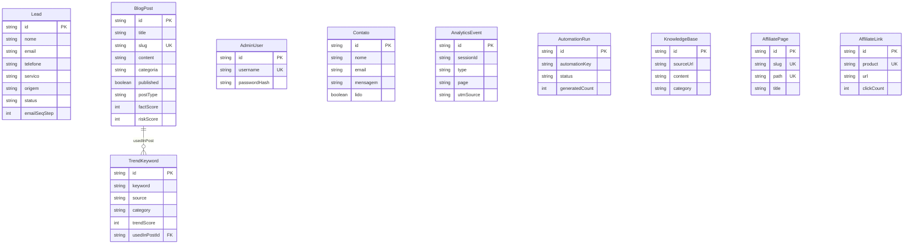
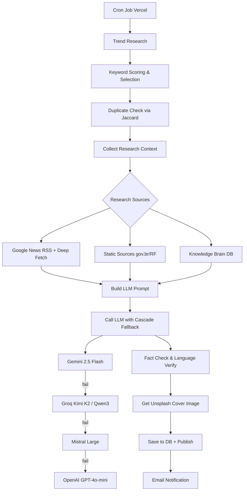
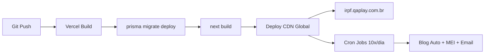

# 🏗️ PANORAMA COMPLETO — Sistema IRPF-SITE

> **Projeto:** Consultoria IRPF NSB — Site de Nilson Brites  
> **Domínio de produção:** `irpf.qaplay.com.br`  
> **Caminho local:** `e:\Meus Documentos Imp\IRPF-SITE`  
> **Data desta análise:** 26/06/2026  

---

## 1. O QUE É O SITE

Site comercial de **consultoria especializada em declaração de Imposto de Renda Pessoa Física (IRPF)** para o profissional **Nilson Brites**. O produto oferece:

- Declaração IRPF nova, atrasada e retificação
- Regularização de CPF bloqueado e malha fina
- Atendimento 100% online via WhatsApp para todo o Brasil
- Conteúdo educacional via blog com geração automática por IA
- Ferramentas interativas (calculadora IR, simulador de multa, consulta de situação)
- Vertical adicional de conteúdo para **MEI** (Microempreendedor Individual)
- Monetização por **Google AdSense** e **links de afiliados Amazon/Mercado Pago**

---

## 2. STACK TECNOLÓGICO

| Camada | Tecnologia | Versão |
|---|---|---|
| **Framework** | Next.js (App Router) | 14.2.x |
| **Linguagem** | TypeScript | 5.9.x |
| **React** | React + React DOM | 18.3.x |
| **CSS** | Tailwind CSS + Vanilla CSS | 3.4.x |
| **Banco de Dados** | PostgreSQL via Supabase | — |
| **ORM** | Prisma Client | 6.19.x |
| **Autenticação** | NextAuth.js (Credentials) | 4.24.x |
| **IA — Chatbot** | Groq (Llama 3.3 70B) | — |
| **IA — Blog** | Gemini 2.5 Flash (primário), Groq Kimi K2, Mistral, OpenAI (fallback) | — |
| **E-mail** | Resend | 6.9.x |
| **Animações** | Framer Motion | 12.35.x |
| **UI Primitivos** | Radix UI (Accordion, Dialog, Dropdown, Select, Tabs, Toast) | — |
| **Ícones** | Lucide React | 0.577.x |
| **Formulários** | React Hook Form + Zod | 7.71.x / 4.3.x |
| **Fontes** | Google Fonts (Playfair Display + Inter) | — |
| **Deploy** | Vercel (com Cron Jobs) | — |
| **Analytics** | GA4 + Google Ads + Meta Pixel | — |
| **Monetização** | Google AdSense + Afiliados Amazon | — |

### Design System (Tailwind)

```
cores:  base=#F9F7F2  preto=#1A1A1A  verde=#2D4033  ouro=#C9A84C
fontes: serif=Playfair Display  sans=Inter
tema:   dark mode via classe "class"
```

---

## 3. ARQUITETURA DE DIRETÓRIOS

```
IRPF-SITE/
├── app/                          ← App Router (Next.js 14)
│   ├── layout.tsx                ← Root layout (fonts, analytics, AdSense, SEO)
│   ├── globals.css               ← Estilos globais + prose para blog
│   ├── sitemap.ts                ← Sitemap dinâmico (estáticas + blog posts do DB)
│   ├── not-found.tsx             ← Página 404
│   ├── middleware.ts             ← Middleware (pass-through atual)
│   │
│   ├── (site)/                   ← Route Group — páginas públicas
│   │   ├── layout.tsx            ← Layout com Navbar, Footer, ChatBot, WhatsApp, Cookie
│   │   ├── page.tsx              ← Homepage
│   │   ├── blog/                 ← Blog listing + /blog/[slug] dinâmico
│   │   ├── mei/                  ← 28+ subpáginas de conteúdo MEI/afiliados
│   │   ├── ferramentas/          ← Calculadora IR, Simulador Multa, Consulta Situação
│   │   ├── servicos/             ← Página de serviços
│   │   ├── como-funciona/        ← Como funciona o processo
│   │   ├── sobre/                ← Sobre o Nilson Brites
│   │   ├── contato/              ← Formulário de contato
│   │   ├── ebook/                ← Lead magnet (e-book)
│   │   ├── declarar-agora/       ← Landing page de conversão
│   │   ├── consulte-sem-medo/    ← Landing page alternativa
│   │   ├── desenrola-brasil/     ← Conteúdo Desenrola Brasil
│   │   ├── quem-deve-declarar-*/ ← Conteúdo SEO específico
│   │   ├── tabela-irpf-2026/     ← Conteúdo SEO específico
│   │   ├── politica-de-privacidade/
│   │   └── termos-de-uso/
│   │
│   ├── painel-nb-2025/           ← Painel Administrativo (protegido por NextAuth)
│   │   ├── layout.tsx + page.tsx ← Login + Dashboard
│   │   ├── blog/                 ← CRUD de posts
│   │   ├── leads/                ← Gestão de leads (Kanban)
│   │   ├── campanhas/            ← Geração de campanhas
│   │   ├── chat-ia/              ← Chat IA admin
│   │   ├── dashboard/            ← Métricas
│   │   ├── trends/               ← Pesquisa de tendências
│   │   ├── afiliados/            ← Gestão de afiliados
│   │   ├── analisador/           ← Analisador de site
│   │   └── imagens/              ← Upload de imagens
│   │
│   ├── api/                      ← API Routes (Route Handlers)
│   │   ├── chatbot/              ← Chatbot público (route.ts + speak/ + transcribe/)
│   │   ├── blog/                 ← Geração de posts (generate, amazon, motorista)
│   │   ├── cron/                 ← Jobs agendados (blog-auto, blog-mei, email-seq, trend)
│   │   ├── admin/                ← APIs admin (blog CRUD, leads, campanhas, analytics, chat)
│   │   ├── leads/                ← Captura de leads
│   │   ├── contato/              ← Recebimento de contatos
│   │   ├── calculadora/          ← Cálculo de IR via API
│   │   ├── ebook/                ← Download de e-book
│   │   ├── analytics/            ← Eventos de analytics
│   │   ├── afiliados/            ← Tracking de cliques
│   │   ├── auth/                 ← NextAuth endpoints
│   │   ├── revalidate/           ← ISR on-demand
│   │   └── upload/               ← Upload de imagens
│   │
│   └── news-sitemap.xml/         ← News sitemap para Google News
│
├── components/
│   ├── site/                     ← 29 componentes públicos (Hero, Navbar, Footer, etc.)
│   ├── admin/                    ← 6 componentes admin (Sidebar, Kanban, Leads, etc.)
│   ├── ads/                      ← AdUnit.tsx (Google AdSense)
│   ├── analytics/                ← AnalyticsTracker + WhatsAppConversionTracker
│   └── seo/                      ← JsonLd.tsx (Schema.org structured data)
│
├── lib/                          ← 33 módulos de lógica de negócio
│   ├── blog-engine.ts            ← Motor principal de geração de posts (85KB!)
│   ├── mei-blog-engine.ts        ← Motor de geração para conteúdo MEI (42KB)
│   ├── llm-providers.ts          ← Cascade multi-LLM com fallback (26KB)
│   ├── chatbot-prompt.ts         ← System prompt do chatbot vendedor (17KB)
│   ├── mei-context.ts            ← Base de conhecimento MEI (25KB)
│   ├── irpf-context.ts           ← Base de conhecimento IRPF (6KB)
│   ├── ir-calculations.ts        ← Cálculos de IR (tabela progressiva)
│   ├── knowledge-brain.ts        ← Sistema de knowledge base dinâmica
│   ├── trend-research.ts         ← Pesquisa de tendências Google Trends
│   ├── keyword-scoring.ts        ← Scoring e seleção de keywords SEO
│   ├── campaign-priority.ts      ← Priorização de campanhas editoriais
│   ├── fact-check.ts             ← Verificação factual de posts gerados
│   ├── email-templates.ts        ← Templates de e-mail (onboarding, nurturing)
│   ├── notification-hub.ts       ← Hub de notificações
│   ├── amazon-affiliate-*.ts     ← Engine e content map para afiliados Amazon
│   ├── motorista-*.ts            ← Engine e content map para conteúdo motorista
│   ├── affiliate-*.ts            ← Registry e compliance de afiliados
│   ├── auth.ts                   ← Configuração NextAuth (bcrypt + JWT)
│   ├── prisma.ts                 ← Singleton Prisma Client
│   ├── supabase.ts               ← Cliente Supabase
│   └── ...                       ← utils, phone-validation, resend, etc.
│
├── prisma/
│   ├── schema.prisma             ← Schema do banco (16 modelos)
│   └── migrations/               ← 6 migrations aplicadas
│
├── public/                       ← Assets estáticos (fotos, favicon, robots.txt, ads.txt)
├── scripts/                      ← 51 scripts utilitários (seeds, audits, tests, fixes)
├── docs/                         ← 5 documentos técnicos
└── GROUND_TRUTH_IRPF.md          ← Base de conhecimento verificada do IRPF (26KB)
```

---

## 4. MODELO DE DADOS (Prisma + Supabase PostgreSQL)

### 16 Modelos — Diagrama de Entidades



### Modelos Principais

| Modelo | Propósito | Registros típicos |
|---|---|---|
| **Lead** | Leads capturados (chatbot, formulários, ebook) | Centenas |
| **BlogPost** | Posts do blog (gerados por IA ou manual) | 100+ |
| **TrendKeyword** | Keywords de tendência pesquisadas | Milhares |
| **Contato** | Mensagens do formulário de contato | Dezenas |
| **AdminUser** | Usuário(s) admin do painel | 1 |
| **AnalyticsEvent** | Eventos de analytics first-party | Milhares |
| **AutomationRun** | Registro de execuções de cron jobs | Centenas |
| **KnowledgeBase** | Base de conhecimento dinâmica (scraped) | Dezenas |
| **ApiQuota** | Controle de cotas de APIs externas | Dezenas |
| **AffiliatePage/Link/Cta** | Páginas e links de afiliados | Dezenas |
| **EbookDownload** | Downloads do e-book (lead magnet) | Dezenas |
| **Analise/CampanhaGerada** | Análises e campanhas geradas pelo admin | Dezenas |
| **KeywordHistory** | Histórico de keywords usadas | Centenas |

---

## 5. FUNCIONALIDADES DETALHADAS

### 5.1 Site Público (Visitante)

| Funcionalidade | Componentes | Descrição |
|---|---|---|
| **Homepage** | Hero, Marquee, Serviços, Split, DadosOficiais, Restituição, Calculadora, Contato, BlogPreview, Processo, FAQ | Landing page completa com CTA para WhatsApp |
| **Calculadora de IR** | `CalculadoraSection.tsx` + `/api/calculadora` | Calcula IR com base na tabela progressiva oficial |
| **Simulador de Multa** | `/ferramentas/simulador-multa` | Simula multa por atraso na entrega |
| **Consulta Situação** | `/ferramentas/consulta-situacao` | Verifica se precisa declarar |
| **Blog** | `BlogListingClient.tsx` + `/blog/[slug]` | Blog com posts gerados por IA, FAQs, SEO completo |
| **Chatbot IA** | `ChatbotWidget.tsx` + `/api/chatbot` | Chatbot vendedor com Llama 3.3 70B (Groq) |
| **WhatsApp Float** | `WhatsAppFloat.tsx` | Botão flutuante de WhatsApp |
| **Exit Intent Modal** | `ExitIntentModal.tsx` | Modal de retenção ao sair da página |
| **Cookie Consent** | `CookieConsent.tsx` | Banner de consentimento LGPD |
| **E-book** | `/ebook` + `EbookForm.tsx` | Lead magnet com captura de e-mail |
| **Seção MEI** | 28+ subpáginas | Conteúdo SEO para MEI + afiliados maquininha |
| **Contato** | `ContatoSection.tsx` + `/api/contato` | Formulário com envio de e-mail |
| **SEO** | JsonLd, sitemap dinâmico, meta tags | Schema.org, Open Graph, Twitter Cards |

### 5.2 Painel Administrativo (`/painel-nb-2025`)

| Módulo | Funcionalidades |
|---|---|
| **Dashboard** | Métricas de leads, posts, views |
| **Blog** | CRUD de posts, geração por IA, geração de imagens, publicar/despublicar |
| **Leads** | Visualização Kanban, filtros, detalhes, pipeline de vendas, export |
| **Campanhas** | Geração de campanhas de marketing por IA |
| **Chat IA** | Chat interno com IA para o admin |
| **Trends** | Pesquisa de tendências e keywords |
| **Afiliados** | Gestão de links e páginas de afiliados |
| **Analisador** | Análise de site/concorrência |
| **Imagens** | Upload e gestão de imagens |

### 5.3 Sistema de Blog Automático (IA)

> [!IMPORTANT]
> Este é o coração técnico do projeto — o `blog-engine.ts` tem **2.106 linhas** e **85KB**.

**Pipeline de geração:**



**Cron Schedule (Vercel):**

| Job | Horários (UTC) | Função |
|---|---|---|
| `blog-auto` | 09, 10, 13:40, 15, 17, 19, 21, 22h | Gera posts IRPF (até 8x/dia) |
| `blog-mei` | 12, 18h | Gera posts MEI (2x/dia) |

**LLM Cascade (tolerância a falhas):**

```
Tier 1: Gemini (flash-lite → flash → 2.0-flash) × N chaves
Tier 2: Groq (Kimi K2 → Qwen3-32B) × 3 chaves
Tier 3: Mistral (large-latest)
Tier 4: OpenAI (gpt-4o-mini) — pago, último recurso
```

Inclui: dead model cache, rate-limit cooldown por chave, timeout por request, validação JSON, detecção de idioma (PT-BR), verificação de similaridade Jaccard contra posts existentes.

### 5.4 Chatbot Vendedor

- **Modelo:** Llama 3.3 70B via Groq
- **Personalidade:** "Bot Nilson" — consultor caloroso, direto, comercial
- **Escopo fixo:** Apenas IRPF/MEI — anti-jailbreak robusto
- **Conversão:** Detecta frase "Fale conosco pelo WhatsApp" e exibe botão
- **Features:** Text-to-speech (`/api/chatbot/speak`), transcrição de áudio (`/api/chatbot/transcribe`)

### 5.5 Sistema de E-mails

- **Provider:** Resend (grátis até 3.000/mês)
- **Sequências:** Onboarding, nurturing, follow-up automático
- **Cron:** `/api/cron/email-sequence` para envios agendados
- **Templates:** HTML em `lib/email-templates.ts`

---

## 6. INTEGRAÇÕES EXTERNAS

| Serviço | Uso | Custo |
|---|---|---|
| **Supabase** | PostgreSQL + storage | Grátis (free tier) |
| **Vercel** | Hosting + Cron Jobs + Edge | Grátis (hobby) |
| **Groq** | Chatbot + blog fallback | Grátis |
| **Google Gemini** | Geração principal de blog | Grátis (free tier) |
| **Mistral** | Fallback LLM | Grátis (freemium) |
| **OpenAI** | Último fallback (desabilitado por padrão) | Pago (~R$5-8/mês) |
| **Resend** | Envio de e-mails | Grátis (até 3k/mês) |
| **Google AdSense** | Monetização por anúncios | Receita |
| **Google Ads** | Tracking de conversões | — |
| **GA4** | Analytics | Grátis |
| **Meta Pixel** | Tracking Facebook | Grátis |
| **Unsplash** | Imagens de capa do blog | Grátis (API) |
| **Amazon Affiliates** | Links de afiliados em posts | Receita |
| **Banco Central API** | Taxa Selic atual | Grátis |
| **Google Trends RSS** | Tópicos em alta | Grátis |

**Custo mensal estimado total: ~R$7-12/mês**

---

## 7. SEGURANÇA

| Aspecto | Implementação |
|---|---|
| **Autenticação** | NextAuth.js com bcrypt hash + JWT (24h expiry) |
| **Headers** | X-Frame-Options: DENY, HSTS, nosniff, Referrer-Policy |
| **Admin** | Rota obscura `/painel-nb-2025`, credenciais via env vars |
| **Cron** | Protegido por `CRON_SECRET` |
| **Scripts de ads** | Carregados apenas no hostname de produção (`irpf.qaplay.com.br`) |
| **Chatbot** | Anti-jailbreak com 6 regras explícitas de contenção |
| **Env vars** | `.env.local` no `.gitignore`, variáveis sensíveis na Vercel |

---

## 8. SEO E MONETIZAÇÃO

### SEO

- Sitemap dinâmico (estáticas + blog posts do DB)
- News sitemap para Google News
- Schema.org (JsonLd) em todas as páginas
- Meta tags OpenGraph + Twitter Cards
- robots.txt + ads.txt
- llms.txt (protocolo para crawlers de IA)
- Canonical URLs
- H1 único por página

### Monetização

- **Google AdSense:** Componente `AdUnit.tsx` com slots configuráveis
- **Amazon Affiliates:** Links estilizados como botões CTA no conteúdo do blog
- **Mercado Pago Affiliates:** Maquininhas para MEI (28+ landing pages)
- **Conversão direta:** Todos os fluxos levam ao WhatsApp para contratação

---

## 9. DEPLOY E INFRAESTRUTURA



- **Hosting:** Vercel (hobby plan)
- **Database:** Supabase PostgreSQL (São Paulo, sa-east-1)
- **Connection:** PgBouncer (porta 6543) + Direct (porta 5432)
- **SSL:** Let's Encrypt automático via Vercel
- **DNS:** CNAME `irpf` → `cname.vercel-dns.com`
- **Functions timeout:** Blog-auto (300s), Blog-mei (180s), Trend-research (60s)

---

## 10. PONTOS DE ATENÇÃO E OPORTUNIDADES DE MELHORIA

### ⚠️ Débitos Técnicos

| # | Problema | Impacto | Prioridade |
|---|---|---|---|
| 1 | `blog-engine.ts` com 2.106 linhas / 85KB | Difícil de manter e testar | Alta |
| 2 | `llm-providers.ts` com 595 linhas | Lógica complexa de cascade, difícil debug | Média |
| 3 | Sem testes automatizados (0 test files) | Regressões não detectadas | Alta |
| 4 | `middleware.ts` é pass-through (não faz nada) | Código morto | Baixa |
| 5 | 51 scripts soltos em `/scripts` sem organização | Difícil saber quais são atuais | Baixa |
| 6 | Dependências misturadas (dev em dependencies) | Build mais pesado | Baixa |
| 7 | OG image é SVG (não recomendado para redes sociais) | Prévia pode não renderizar | Média |

### 🚀 Oportunidades de Melhoria

| # | Melhoria | Benefício |
|---|---|---|
| 1 | Extrair blog-engine em módulos menores | Manutenibilidade, testabilidade |
| 2 | Adicionar testes (Vitest/Jest) | Confiança em deploys |
| 3 | Implementar ISR (Incremental Static Regeneration) nas páginas do blog | Performance e SEO |
| 4 | Migrar OG image para PNG/JPG gerado | Compatibilidade social media |
| 5 | Dashboard admin com métricas em tempo real (WebSocket) | UX do admin |
| 6 | Sistema de A/B testing para CTAs e landing pages | Otimização de conversão |
| 7 | Cache layer (Redis/Upstash) para chatbot e blog | Reduzir chamadas LLM |
| 8 | Notificações push (web) para novos leads | Tempo de resposta |
| 9 | Multi-tenant (atender outros consultores) | Escala do negócio |
| 10 | PWA (Progressive Web App) | Experiência mobile |

---

## 11. RESUMO EXECUTIVO

O **IRPF-SITE** é uma plataforma full-stack de **marketing digital + consultoria tributária** que combina:

1. **Site institucional** de alto padrão visual (Tailwind + Framer Motion)
2. **Blog automatizado por IA** com pipeline sofisticado de 5 provedores LLM
3. **Chatbot vendedor** treinado especificamente para conversão de leads IRPF
4. **Painel admin** completo com gestão de leads (Kanban), blog, campanhas e analytics
5. **Monetização tripla** (serviço direto + AdSense + afiliados)

Tudo rodando com custo operacional de **~R$7-12/mês**, deployado na Vercel com banco Supabase gratuito. O sistema é tecnicamente ambicioso — especialmente o cascade de LLMs e o blog engine — mas carece de testes automatizados e modularização do código core.
